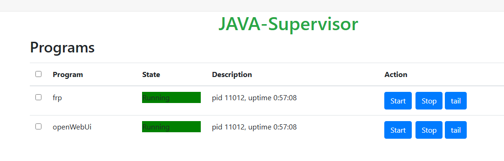
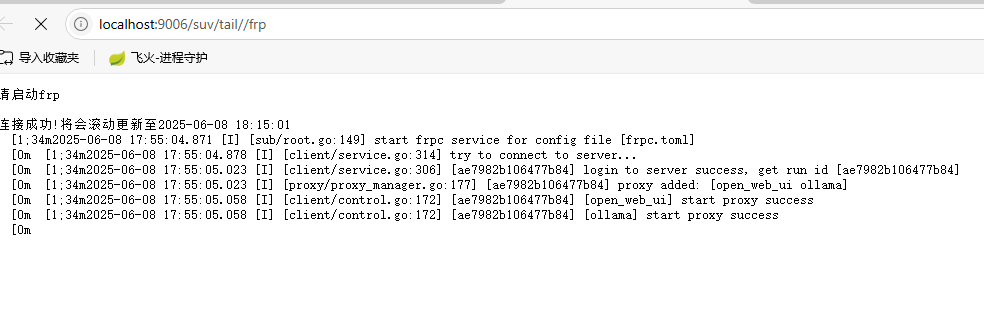

# java-suv

用java写的进程守护工具

# 简介
- 一个适用window上的进程守护工具,具有web节目,自启动,查看运行日志
- 使用java编写,能够管理多个进程,减少win上的命令行窗口
- 适用于java,python,c,conda多语言
- 用frp,ollama,open-webui,java等做过测试
- 使用简单,【java -jar java-suv-1.0-SNAPSHOT.jar】
- 架构简洁,源码通俗易懂
- 性能高效,针对java的队列的做了byte特化处理,减少装箱拆箱的损耗

# 运行要求
- 要求jdk17(如果没有可以采取绝对路径的方式运行)。
也算是为jdk版本升级做出自己的贡献
- 配置环境变量
  - suv_config:指定【suv.yml】的路径
  - suv_data:指定数据的生成路径
# 页面展示:
- 通过【http://localhost:9006】查看
- 
- 


# 【suv.yml】配置文件展示
```yaml
suv:
  logDir: "D:/temp/java-suv-logs"
  program:
    frp:
      direction: "D:/code_tool/open_source_tool/frp_0.62.1_windows_amd64"
      # 一定不能忘记加.exe
      command: "cmd.exe /c frpc.exe -c frpc.toml"
      autostart: false
    openWebUi:
      direction: "D:/code/open_code/open-webui"
      # command: "frpc.exe -c frpc.toml"
      command: "cmd.exe /c startOwu.bat"
      autostart: false
```

- direction:程序的工作目录
- command:该目录所执行的命令
- autostart:自启动
- 注意:window上的程序最好把后缀(exe,bat) 加上，要不然会报错找不到
